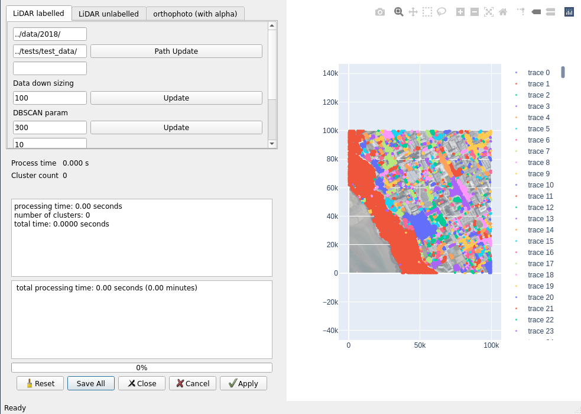
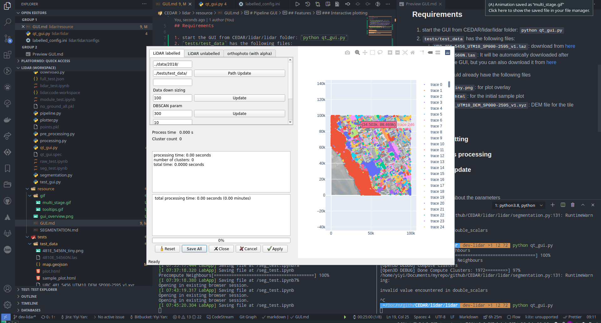
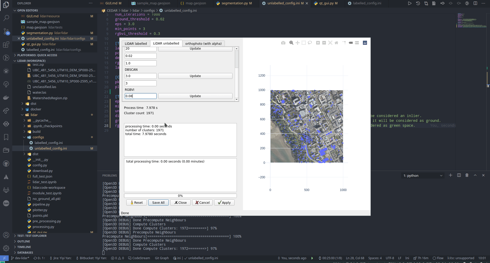
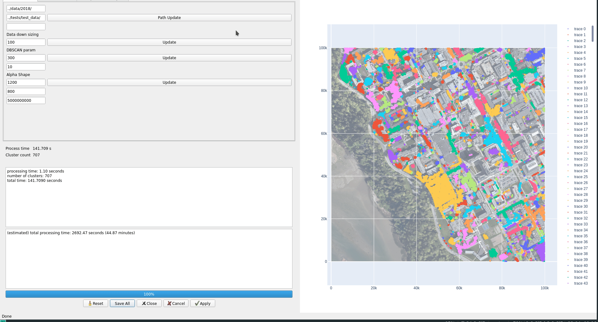

# Pipeline GUI 

## Requirements

1. start the GUI from TREESAP/lidar/lidar folder: `python qt_gui.py`
2. `tests/test_data` has the following files:
   1. `UBC_481_5456_UTM10_SP000-2595_v1.laz`: download from [here](https://abacus.library.ubc.ca/file.xhtml?persistentId=hdl:11272.1/AB2/KET75X/AGQOTG&version=2.0)
   2. `4810E_54560N.las`: It will be automatically downloaded after running the GUI, but you can also download it from [here](https://webtransfer.vancouver.ca/opendata/2018LiDAR/4810E_54560N.las)
   3. `481E_5456N.png`: Download the TIF file from [link](https://abacus.library.ubc.ca/dataset.xhtml?persistentId=hdl:11272.1/AB2/KIZZ4L) and unzip it.
tests/test_data should already have the following files
- `481E_5456N_tiny.png`: for plot overlay
- `UBC_481_5456_UTM10_DEM_SP000-2595_v1.xyz`: DEM file for the tile
  
## Features
The pipeline GUI is designed to be an interactive, complete and fast parameter tuning tool for the LiDAR pipeline. The goal is to test the pipeline parameters on a smaller scale before commit to a large dataset, which might take a lot of resource to compute.

### Interactive plotting
We used plotly and PyQt5 WebEgnineView to let user interactively inspect pipeline's result testing dataset.

### Whole campus processing
The testing plot gives a general idea of how long it will take to process the whole campus. 

### Multi-stages update
To speed up the tuning process, we saved intermediate files that will be repeatedly used, or shared by some parameters, locally in compressed files. Each **Update** button represents a stage.

### Tooltips hints
Explaining details about the parameters by hovering the mouse over the content of the parameters. Since every single parameters has a tooltips description, we will not go into details here. 

**I am very sorry I couldn't make dark theme work in docker, that's why it's the default theme :anguished:**

